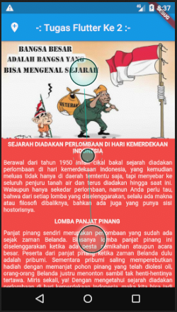
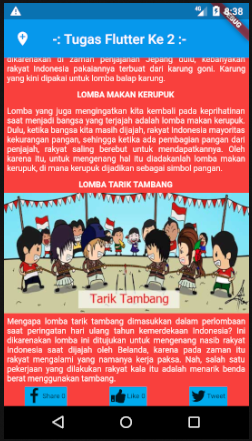

# Tugas ke 2 Flutter ( TUGAS02 - OSG8 )

Buat aplikasi Flutter Sederhana dengan ketentuan:

1. Menggunakan widget Image, Text, Row, Column, dan Icon dalam satu halaman.
2. Gambar boleh berupa Image Assets maupun Image Network.
3. Judul, deskripsi, icon, dan sebagainya bertemakan Hari Kemerdekaan Indonesia (17an).

## Screenshot

 

## Built With

[Flutter](https://flutter.dev) Menggunakan Visual Studio Code dengan bahasa DART.

## Created By

TOMY DWI DAYANTO.

## Online Study Group Eudeka!

Salah satu program dari Eudeka! untuk belajar secara full online via Whatsapp/Telegram dan Google Classroom, dengan para praktisi handal di bidangnya. Selain itu juga kamu dapat berkesempatan untuk memperluas koneksimu dengan peserta lain.

## OSG08 - Flutter

Dengan jangka waktu lebih kurang 2 bulan, peserta diharapkan dapat mengenal dan membuat aplikasi simple Flutter dengan menggunakan data dari internet (API).

## Cara Mendaftar Online Study Group

Untuk pendaftaran kelas selanjutnya, silahkan kunjungi atau hubungi kami di dawah ini.

## Info Lebih Lengkap

Website : [www.eudeka.id](https://www.eudeka.id).  
Twitter: [@EudekaID](https://twitter.com/EudekaID).  
Telegram : [@eudekainfo](https://t.me/eudekainfo).  
Instagram : [@eudeka.id](https://instagram.com/eudeka.id).  
WhatsApp : [0895351577557](https://wa.me/62895351577557).  
Email : [info@eudeka.id](mailto:info@eudeka.id).