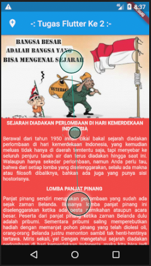
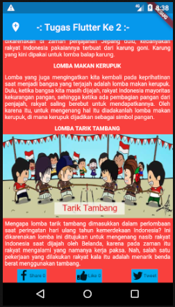

# Tugas ke 2 Flutter ( {{kode_tugas}} )
Buat aplikasi Flutter Sederhana dengan ketentuan:

1. Menggunakan widget Image, Text, Row, Column, dan Icon dalam satu halaman.
2. Gambar boleh berupa Image Assets maupun Image Network.
3. Judul, deskripsi, icon, dan sebagainya bertemakan Hari Kemerdekaan Indonesia (17an).

## Screenshot
 .

## Built With
Menggunakan Visual Studio Code dengan bahasa DART.

## Created By
TOMY DWI DAYANTO.

## {{jenis_kelas}} Eudeka!
{{tentang_kelas}}.

## {{nama_kelas}}
Dengan jangka waktu lebih kurang {{waktu_kelas}}, peserta diharapkan dapat {{tujuan_kelas}}.

## Cara Mendaftar {{jenis_kelas}}
{{cara_daftar}}.

## Info Lebih Lengkap
Website : [www.eudeka.id](https://www.eudeka.id).  
Twitter: [@EudekaID](https://twitter.com/EudekaID).  
Telegram : [@eudekainfo](https://t.me/eudekainfo).  
Instagram : [@eudeka.id](https://instagram.com/eudeka.id).  
WhatsApp : [0895351577557](https://wa.me/62895351577557).  
Email : [info@eudeka.id](mailto:info@eudeka.id).  

[nama_project]: Peserta
[tentang_project]: Peserta
[screenshot_project]: Peserta
[teknologi_digunakan]: Peserta
[nama_peserta]: Peserta

[kode_tugas]: Eudeka
[jenis_kelas]: Eudeka
[nama_kelas]: Eudeka
[tentang_kelas]: Eudeka
[waktu_kelas]: Eudeka
[tujuan_kelas]: Eudeka
[cara_daftar]: Eudeka
[kode_kelas]: Eudeka